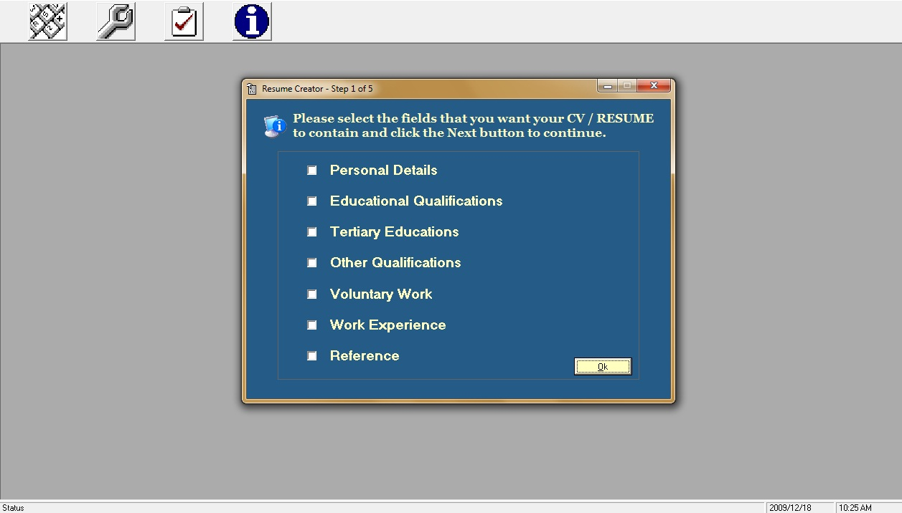



## CV Creator

### Description

Program uses VBA Micros to take data and enter it on Microsoft Word for a quick and easy way to create a Curriculum Vitae.

This program was inspired when a stranger I met in internet cafe could apply for a post cause his floppy disk got damaged.

Internet Cafes should have a program that helps their clients easly create a CV when their storage device get faulty unexpectedly.
 
### More Info
 
Fill in your details and choose one of the demo designs I created.

Watch and enjoy as your CV gets created faster than the court type writer could type.

Please note that this programs has been tested on Microsoft Word 2000, XP, 2003 &amp; 2007

             |
---                |---
**Submitted On**   |2009-01-11 11:37:06
**By**             |[Sipho S\. Mbenenge](https://github.com/Planet-Source-Code/PSCIndex/blob/master/ByAuthor/sipho-s-mbenenge.md)
**Level**          |Intermediate
**User Rating**    |4.3 (13 globes from 3 users)
**Compatibility**  |VB 6\.0
**Category**       |[Microsoft Office Apps/VBA](https://github.com/Planet-Source-Code/PSCIndex/blob/master/ByCategory/microsoft-office-apps-vba__1-42.md)
**World**          |[Visual Basic](https://github.com/Planet-Source-Code/PSCIndex/blob/master/ByWorld/visual-basic.md)
**Archive File**   |[CV\_Creator21706912182009\.zip](https://github.com/Planet-Source-Code/sipho-s-mbenenge-cv-creator__1-72749/archive/master.zip)

